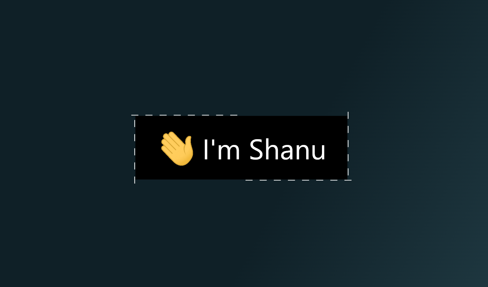
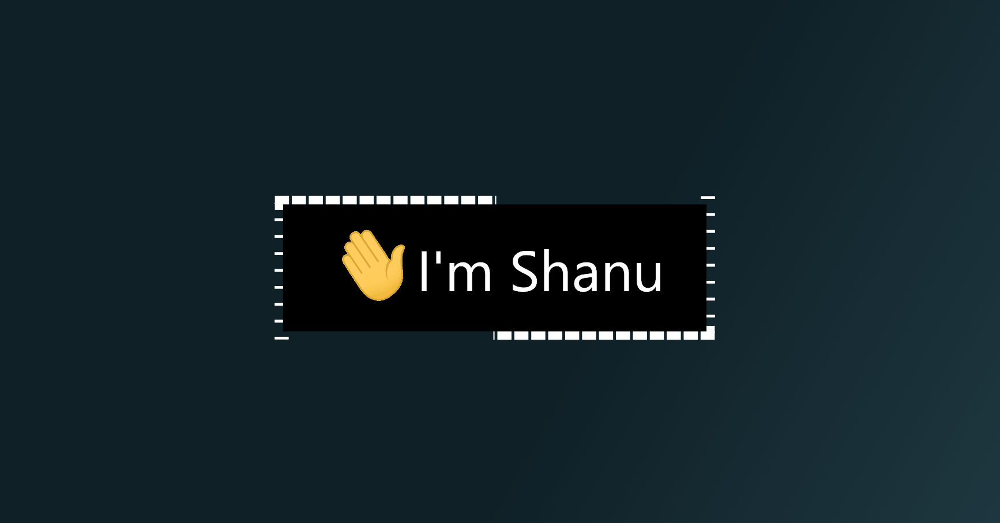
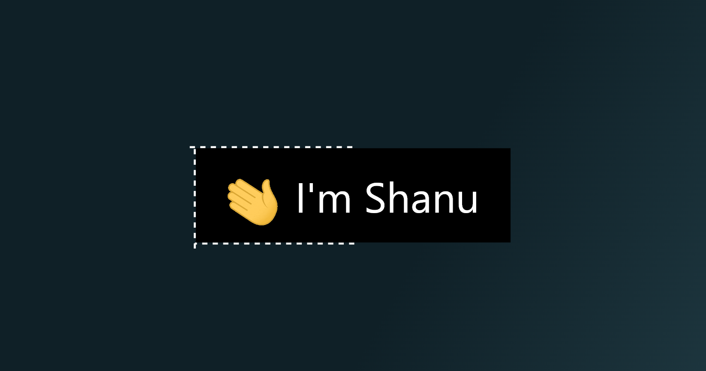

# Flexi Border

A Flutter package that lets you draw customizable borders on any subset of the four sides of a widget, with support for:

* **Solid** or **dashed** lines via `dashPattern`
* **Half** or **full** segment lengths (`BorderMode`) with optional `+/- offsets`
* **Per‐side start/end offsets** to tweak exactly where each segment begins and ends
* **Rounded corners** (when not using `customPath`), or manual corner arcs when you need full control

---

## 📦 Installation

Add to your `pubspec.yaml`:

```yaml
dependencies:
  flexi_border: ^0.0.2
```

Then:

```bash
flutter pub get
```

Import in your Dart code:

```dart
import 'package:flexi_border/flexi_border.dart';
```

---

## 🚀 Usage

### Flutter Examples

#### 1️⃣ Solid Thick Border

```dart
FlexiBorder(
  borderColor: Colors.white,
  strokeWidth: 10,                // thick line
  dashPattern: [],                // empty => solid
  drawTop: true,
  drawRight: true,
  drawBottom: true,
  drawLeft: true,
  borderMode: BorderMode.full,
  child: Container(
    width: 300,
    height: 90,
    color: Colors.black,
    alignment: Alignment.center,
    child: Text(
      "Solid Thick Border",
      style: TextStyle(color: Colors.white),
    ),
  ),
)
```

#### 2️⃣ Evenly Dashed Medium Border

```dart
FlexiBorder(
  borderColor: Colors.cyanAccent,
  strokeWidth: 2,
  dashPattern: [10, 10],          // 10px dash / 10px gap
  drawTop: true,
  drawRight: true,
  drawBottom: true,
  drawLeft: true,
  borderMode: BorderMode.full,
  child: Container(
    width: 300,
    height: 90,
    color: Colors.black,
    alignment: Alignment.center,
    child: Text(
      "Dashed Medium Border",
      style: TextStyle(color: Colors.white),
    ),
  ),
)
```

#### 3️⃣ Mixed‐Style Custom Side

```dart
FlexiBorder(
  borderColor: Colors.orangeAccent,
  strokeWidth: 2,
  dashPattern: [5, 2],            // 5px dash / 2px gap
  drawTop: true,
  drawRight: false,               // skip the right edge
  drawBottom: true,
  drawLeft: true,
  borderMode: BorderMode.half + 20,
  child: Container(
    width: 300,
    height: 90,
    padding: EdgeInsets.symmetric(horizontal: 16),
    color: Colors.black,
    child: Row(
      children: [
        Text(
          "👋 I'm Shanu",
          style: TextStyle(color: Colors.white, fontSize: 20),
        ),
      ],
    ),
  ),
)
```

---

## 🌐 Live Preview

### 1️⃣ Solid Thick Border



---

### 2️⃣ Evenly Dashed Medium Border



---

### 3️⃣ Mixed-Style Custom Side



---

## 📖 API Reference

Import:

```dart
import 'package:flexi_border/flexi_border.dart';
```

### `FlexiBorder` Widget

| Property            | Type           | Default           | Description                                 |
| ------------------- | -------------- | ----------------- | ------------------------------------------- |
| `child`             | `Widget`       | **Required**      | The widget you're wrapping with the border. |
| `borderColor`       | `Color`        | `Colors.white`    | Color of the border line.                   |
| `dashPattern`       | `List<double>` | `[4,2]`           | `[dashLength, gapLength]`. `[]` = solid.    |
| `strokeWidth`       | `double`       | `1`               | Width of the border stroke.                 |
| `drawTop`           | `bool`         | `true`            | Whether to draw the top side.               |
| `drawRight`         | `bool`         | `true`            | Whether to draw the right side.             |
| `drawBottom`        | `bool`         | `true`            | Whether to draw the bottom side.            |
| `drawLeft`          | `bool`         | `true`            | Whether to draw the left side.              |
| `borderMode`        | `BorderMode`   | `BorderMode.full` | `.full` (100%) or `.half` (50%) + offset.   |
| `topStartOffset`    | `double`       | `0`               | Shift the top start X by this many px.      |
| `topEndOffset`      | `double`       | `0`               | Shift the top end X by this many px.        |
| `rightStartOffset`  | `double`       | `0`               | Shift the right start Y by this many px.    |
| `rightEndOffset`    | `double`       | `0`               | Shift the right end Y by this many px.      |
| `bottomStartOffset` | `double`       | `0`               | Shift the bottom start X by this many px.   |
| `bottomEndOffset`   | `double`       | `0`               | Shift the bottom end X by this many px.     |
| `leftStartOffset`   | `double`       | `0`               | Shift the left start Y by this many px.     |
| `leftEndOffset`     | `double`       | `0`               | Shift the left end Y by this many px.       |

### `BorderMode`

| Member                 | Description                       |
| ---------------------- | --------------------------------- |
| `BorderMode.full`      | Use full `child` width/height.    |
| `BorderMode.half`      | Use half of `child` width/height. |
| `BorderMode.half + 20` | Use half + 20px.                  |
| `BorderMode.full - 10` | Use full - 10px.                  |

---

## ✅ Contributing

PRs welcome! Feel free to open issues or submit pull requests on [GitHub](https://github.com/yourusername/flexi_border).

---

## 📜 License

MIT © 2025 Shanu33

```
```
